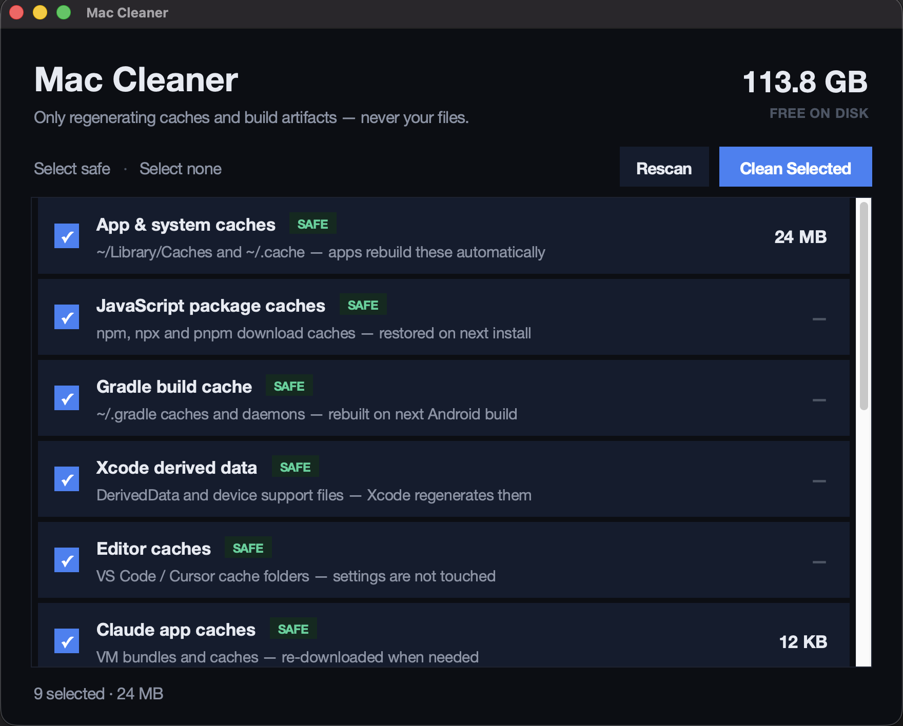

# 🧹 Mac Cleaner

A **safe, transparent disk-space cleaner for macOS** with a modern dark UI.
Scans well-known cache and build-artifact locations, shows you exactly what it
found with per-item sizes, and deletes **only what you select** — never your
files, documents, or settings.




## Why another cleaner?

Most "cleaner" apps are opaque about what they delete. Mac Cleaner is the
opposite:

- **Every category is listed with its exact path and size** before anything happens
- **You select individually** — nothing is deleted without your say-so
- **Safety badges** on every row:
  - 🟢 `SAFE` — auto-regenerating caches (npm, Gradle, Xcode DerivedData, app caches…)
  - 🟡 `CAUTION` — things with a real cost (Trash, emulator data) — each asks for
    an extra confirmation
  - 🔴 `ADMIN` — root-owned leftovers, deleted via the native macOS password prompt
- **Open source, ~700 lines, zero dependencies** — read exactly what it does

## What it cleans

| Category | Badge | Details |
|---|---|---|
| App & system caches | 🟢 SAFE | `~/Library/Caches`, `~/.cache` (+ `brew cleanup`) |
| JavaScript package caches | 🟢 SAFE | npm `_cacache`/`_npx`, pnpm store |
| Gradle build cache | 🟢 SAFE | `~/.gradle` caches, daemons, wrappers |
| Xcode derived data | 🟢 SAFE | DerivedData, iOS DeviceSupport |
| Editor caches | 🟢 SAFE | VS Code / Cursor cache folders |
| Claude app caches | 🟢 SAFE | VM bundles, GPU/code caches |
| Old Claude CLI versions | 🟢 SAFE | Superseded builds (newest kept) |
| Stremio stream cache | 🟢 SAFE | Cached video streams |
| Expo caches | 🟢 SAFE | Expo Go, APK caches |
| Trash | 🟡 CAUTION | Gone for good — asks first |
| Android emulator data | 🟡 CAUTION | Wipes AVD storage; refuses while the emulator runs |
| iOS simulator devices | 🟡 CAUTION | `~/Library/Developer/CoreSimulator` |
| iOS simulator runtimes | 🔴 ADMIN | `/Library/Developer/CoreSimulator` via password prompt |

Anything that doesn't exist on your Mac simply shows `—` and is skipped.

## What it will never touch

Your documents, photos, projects, source code, browser profiles, app settings,
passwords, or anything else that doesn't regenerate itself.

## Install

### Option 1 — download the app (easiest)

Grab `Mac.Cleaner.app.zip` from the
[latest release](../../releases/latest), unzip, and drag to Applications.

> **First launch:** right-click → **Open** (the app is unsigned).
> The pre-built app is Apple Silicon (arm64). On an Intel Mac, run from
> source instead — it works the same.

### Option 2 — run from source (all Macs)

```bash
git clone https://github.com/Dev-Hooman/mac-cleaner.git
cd mac-cleaner
python3 mac_cleaner.py
```

Requires Python 3.9+ with Tkinter. If Python says Tkinter is missing:

```bash
brew install python-tk
```

## Build the app yourself

```bash
python3 -m venv .venv
.venv/bin/pip install pyinstaller
.venv/bin/pyinstaller --windowed --name "Mac Cleaner" mac_cleaner.py
# → dist/Mac Cleaner.app
```

## Safety design

- Sizes are measured with `du -skx` (one filesystem, no double-counting of
  mounted images)
- The Android emulator wipe **refuses to run** while an emulator process is alive
- Admin deletions go through `osascript` → the standard macOS password dialog;
  the app never stores or sees your password
- Every deletion error is swallowed per-item, never crashing a whole run

## License

[MIT](LICENSE) — do whatever you like, no warranty.
