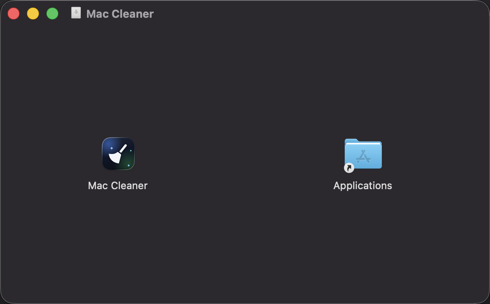
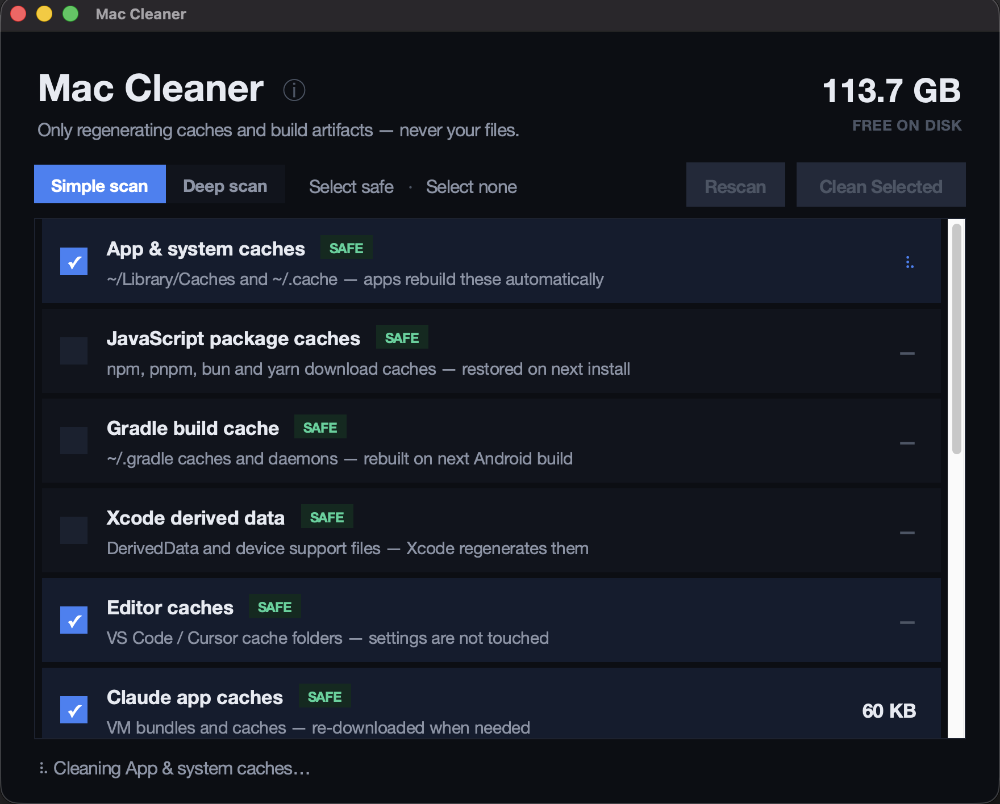

<p align="center">
  
</p>

<h1 align="center">Mac Cleaner</h1>

A **safe, transparent disk-space cleaner for macOS** with a modern dark UI.
Scans well-known cache and build-artifact locations, shows you exactly what it
found with per-item sizes, and deletes **only what you select** — never your
files, documents, or settings.


## Why another cleaner?

Most "cleaner" apps are opaque about what they delete. Mac Cleaner is the
opposite:

- **Every category is listed with its exact path and size** before anything happens
- **You select individually** — nothing is deleted without your say-so
- **Safety badges** on every row:
  - 🟢 `SAFE` — auto-regenerating caches (npm, Gradle, Xcode DerivedData, app caches…)
  - 🟡 `CAUTION` — things with a real cost (Trash, emulator data) — each asks for
    an extra confirmation
  - 🔴 `ADMIN` — root-owned leftovers, deleted via the native macOS password prompt
- **Open source, zero dependencies** — read exactly what it does

## 📦 How to install

**1. Download** `Mac.Cleaner.dmg` from the [latest release](../../releases/latest).

**2. Open the disk image** and drag **Mac Cleaner** onto the **Applications** shortcut:



**3. Eject the disk image** (right-click it on the Desktop → Eject) and launch
**Mac Cleaner** from Applications or Spotlight.

**4. First launch only** — macOS will show *"Apple could not verify Mac Cleaner
is free of malware"*. That's because the app isn't notarized (Apple charges
$99/year for that); the app is open source, so you can verify it yourself.
To open it:

- Click **Done** on the warning, then open **System Settings → Privacy &
  Security**, scroll down to *"Mac Cleaner" was blocked*, and click
  **Open Anyway** — *or*
- Run in Terminal: `xattr -rd com.apple.quarantine "/Applications/Mac Cleaner.app"`
  and launch normally.

This is needed **once**; afterwards the app opens like any other.

> **Intel Macs:** the pre-built app is Apple Silicon (arm64). Run from source
> instead (see below) — it works identically.

## 🧭 How to use

**1. Pick a scan mode.** The app scans automatically on launch.
*Simple scan* covers the always-safe locations; *Deep scan* additionally
discovers project `node_modules` folders, browser profile caches, Xcode
archives and local iPhone/iPad backups.

**2. Select what to clean.** Click a row to select or deselect it —
*Select safe* picks every 🟢 row in one click. The footer shows the total
you've selected. Anything showing `—` doesn't exist on your Mac and is
skipped automatically.

**3. Click "Clean Selected".** 🟡 CAUTION items each ask for confirmation
first, and 🔴 ADMIN items use the standard macOS password dialog. A spinner
shows exactly which category is being cleaned:



**4. Read the result.** Every row reports what actually happened —
`✓ CLEANED`, `PARTIAL — SOME FILES IN USE`, `SKIPPED — PASSWORD CANCELLED`
or `FAILED` — and the footer shows the real amount freed:


**ⓘ About** (next to the title) shows version and developer info.

## What it cleans

| Category | Badge | Details |
|---|---|---|
| App & system caches | 🟢 SAFE | `~/Library/Caches`, `~/.cache` (+ `brew cleanup`) |
| JavaScript package caches | 🟢 SAFE | npm `_cacache`/`_npx`, pnpm, bun, yarn |
| Gradle build cache | 🟢 SAFE | `~/.gradle` caches, daemons, wrappers |
| Xcode derived data | 🟢 SAFE | DerivedData, iOS DeviceSupport |
| Editor caches | 🟢 SAFE | VS Code / Cursor cache folders |
| Claude app caches | 🟢 SAFE | VM bundles, GPU/code caches |
| Old Claude CLI versions | 🟢 SAFE | Superseded builds (newest kept) |
| Stremio stream cache | 🟢 SAFE | Cached video streams |
| Expo caches | 🟢 SAFE | Expo Go, APK caches |
| Trash | 🟡 CAUTION | Gone for good — asks first |
| Android emulator data | 🟡 CAUTION | Wipes AVD storage; refuses while the emulator runs |
| iOS simulator devices | 🟡 CAUTION | `~/Library/Developer/CoreSimulator` |
| iOS simulator runtimes | 🔴 ADMIN | `/Library/Developer/CoreSimulator` via password prompt |

**Deep scan** adds:

| Category | Badge | Details |
|---|---|---|
| Project node_modules | 🟡 CAUTION | Found across your projects — `npm install` restores them |
| Browser caches | 🟢 SAFE | Chrome / Brave / Edge profile caches (quit the browser first) |
| Xcode archives | 🟡 CAUTION | Old distribution archives |
| iPhone / iPad backups | 🟡 CAUTION | Local device backups — irreplaceable |

## What it will never touch

Your documents, photos, projects, source code, browser profiles, app settings,
passwords, or anything else that doesn't regenerate itself.

## Run from source (all Macs)

```bash
git clone https://github.com/Dev-Hooman/mac-cleaner.git
cd mac-cleaner
python3 mac_cleaner.py
```

Requires Python 3.9+ with Tkinter. If Python says Tkinter is missing:

```bash
brew install python-tk
```

## Build the app yourself

```bash
python3 -m venv .venv
.venv/bin/pip install pyinstaller
.venv/bin/pyinstaller --windowed --name "Mac Cleaner" --icon assets/icon.icns mac_cleaner.py
# → dist/Mac Cleaner.app
```

## Safety design

- Sizes are measured with `du -skx` (one filesystem, no double-counting of
  mounted images)
- Mounted simulator runtime volumes are detached before deletion — a plain
  `rm -rf` silently fails on mountpoints
- The Android emulator wipe **refuses to run** while an emulator process is alive
- Admin deletions go through `osascript` → the standard macOS password dialog;
  the app never stores or sees your password
- Every failure is reported per-row — nothing is silently swallowed

## License

[MIT](LICENSE) — do whatever you like, no warranty.

App icon: broom glyph by [UXWing](https://uxwing.com/broom-cleaning-icon/)
(free for commercial use, no attribution required — credited anyway).
